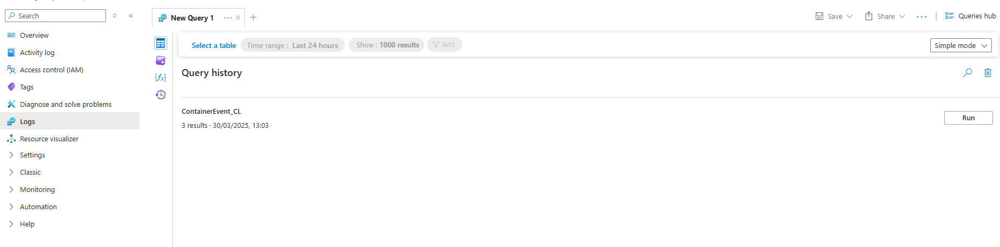

# Step-by-Step Guide to Deploying the CRUD Application on Azure

## Prerequisites

1. **Azure Account**: Ensure you have an active Azure subscription. If you don't have one, you can create a free account.
2. **Azure CLI**: Install the Azure Command-Line Interface (CLI) on your local machine.
3. **Docker**: Install Docker to build and push the container image.
4. **Code Editor**: Use a code editor like Visual Studio Code for editing Bicep files.
5. Anytime in any command it says `<your-app-name>` you have to change it to your own app name.

## Step 1: Set Up Your Environment

1. Open your terminal or command prompt.
2. Log in to your Azure account using the command:
   ```sh
   az login
   ```
3. Set your desired Azure subscription (if you have multiple subscriptions):
   ```sh
   az account set --subscription <your-subscription-id>
   ```

## Step 2: Create the Resource Group

Create a resource group where all resources will be deployed:
```sh
az group create --name <your-app-name>-rg --location eastus
```

- **Resource Group Name:** `<your-app-name>-rg`
- **Location:** `eastus`

## Step 3: Deploy the Infrastructure

Deploy the foundational infrastructure using the `infrastructure.bicep` file. This will create:
- Azure Container Registry (ACR)
- Virtual Network (VNet) and Subnet
- Network Security Group (NSG)
- Log Analytics Workspace

Run the following command:
```sh
az deployment group create --resource-group <your-app-name>-rg --template-file <path-to-infrastructure.bicep> --parameters appName=<your-app-name>
```

### Outputs from the Deployment
After the deployment, note the following outputs:
- **ACR Login Server:** `<your-app-name>acr.azurecr.io`
- **ACR Resource ID:** `/subscriptions/<subscription-id>/resourceGroups/<your-app-name>-rg/providers/Microsoft.ContainerRegistry/registries/<your-app-name>acr`
- **Log Analytics Workspace ID:** `<workspace-id>`

## Step 4: Build and Push the Docker Image

1. **Log in to ACR:**
   ```sh
   az acr login --name <your-app-name>acr
   ```

2. **Build the Docker Image:**
   Navigate to the directory containing the `Dockerfile` and build the image:
   ```sh
   docker build -t <your-app-name>acr.azurecr.io/crud-app:latest .
   ```

3. **Push the Docker Image to ACR:**
   Tag the image and push it to the ACR:
   ```sh
   docker push <your-app-name>acr.azurecr.io/crud-app:latest
   ```

4. **Verify the Image Exists in ACR:**
   - List the repositories:
     ```sh
     az acr repository list --name <your-app-name>acr --output table
     ```
   - Check the tags for the `crud-app` repository:
     ```sh
     az acr repository show-tags --name <your-app-name>acr --repository crud-app --output table
     ```
## Step 5: Retrieve the Log Analytics Workspace Key

Retrieve the `logAnalyticsWorkspaceKey` securely using the Azure CLI:
```sh
az monitor log-analytics workspace get-shared-keys --resource-group <your-app-name>-rg --workspace-name <your-app-name>loganalytics --query primarySharedKey -o tsv
```

Save the key for use in the next step.

## Step 6: Deploy the Application

Deploy the containerized application using the `application.bicep` file. This will:
- Create an Azure Container Instance (ACI)
- Assign the `AcrPull` role to the container instance to allow it to pull the image from ACR
- Configure diagnostics to send logs to the Log Analytics Workspace

Run the following command:
```sh
az deployment group create --resource-group <your-app-name>-rg --template-file <path-to-application.bicep> --parameters appName=<your-app-name> acrLoginServer=<your-app-name>acr.azurecr.io acrName=<your-app-name>acr logAnalyticsWorkspaceId=<workspace-id> logAnalyticsWorkspaceKey=<workspace-key>
```

Replace:
- `<workspace-id>` with the Log Analytics Workspace ID from Step 3.
- `<workspace-key>` with the Log Analytics Workspace Key retrieved in Step 5.

## Step 7: Verify the Deployment

1. **Check the Status of the Container Group:**
   ```sh
   az container show --resource-group <your-app-name>-rg --name <your-app-name>-cg --query instanceView.state -o tsv
   ```

   The expected state is `Running`.

2. **Retrieve the Logs of the Container Instance:**
   ```sh
   az container logs --resource-group <your-app-name>-rg --name <your-app-name>-cg
   ```

3. **Access the Application:**
   Retrieve the FQDN of the container instance:
   ```sh
   az container show --resource-group <your-app-name>-rg --name <your-app-name>-cg --query ipAddress.fqdn -o tsv
   ```

   Open the FQDN in your browser:
   ```plaintext
   http://<fqdn>
   ```

## Step 8: Check Logs in Azure Monitor

1. **Go to the Azure Portal**:
   - Navigate to the Azure Portal: [https://portal.azure.com](https://portal.azure.com).

2. **Find Your Log Analytics Workspace**:
   - Search for "Log Analytics Workspaces" in the search bar.
   - Select your workspace (e.g., `<your-app-name>loganalytics`).

3. **Run a Query to View Logs**:
   - In the Log Analytics Workspace, click on **Logs** in the left-hand menu.
   
   

   - Then click **Select Tables**
   - Open **Custom Logs**
   - And click either one.

## Step 9: Clean Up Resources

To save Azure credits, delete all resources after completing the assignment:

1. **Delete the Resource Group:**
   ```sh
   az group delete --name <your-app-name>-rg --yes --no-wait
   ```

2. **Verify Resource Deletion:**
   ```sh
   az group list --output table
   ```

3. **Remove Docker Images from Local Machine (Optional):**
   ```sh
   docker images
   docker rmi <your-app-name>acr.azurecr.io/crud-app:latest
   ```

4. **Remove Images from ACR (Optional):**
   ```sh
   az acr repository delete --name <your-app-name>acr --repository crud-app --yes
   ```